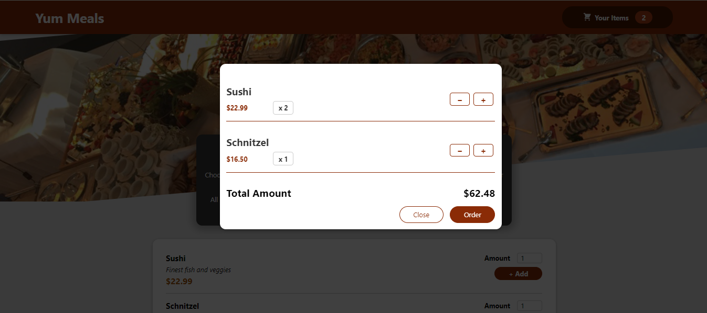

### Purpose 
This project aims to implement a cart functionality in a react app using the following:

#### Hooks

- `useState`
- `useRef`
- `useContext`
- `createContext`
- `useEffect`

Methods 
- `forwardRef()`
- `bind()`
- `createPortal()`

#### Demo 

*Home Screen*

*Cart Empty*

*Cart Items*
